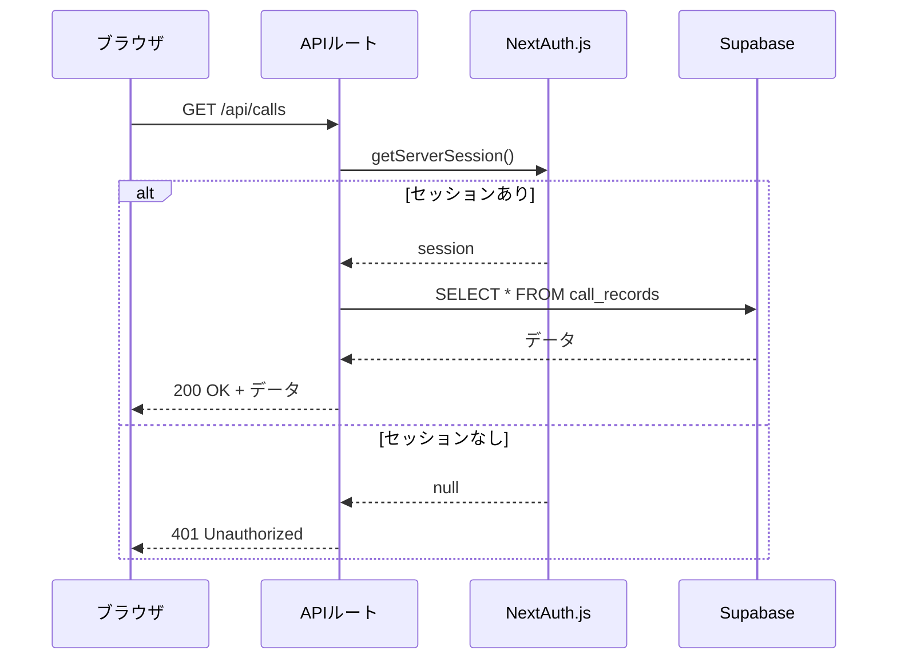

# 技術設計書 (Technical Design Document)

## 概要
REDISH SFA システムのAPIルートに認証ガードを追加し、未認証リクエストを遮断する。NextAuth.jsの`getServerSession`を使用してセッションを検証し、多層防御を実現する。

**目的**: APIルート層での認証チェックにより、RLS（データベース層）と合わせて二重のセキュリティを確立する。
**影響ユーザー**: 未認証ユーザーはAPIにアクセスできなくなる。認証済みユーザーには影響なし。
**システム状態の変更**: 各APIルートに認証チェックを追加。

### ゴール
- 全ての保護対象APIルートに認証ガードを追加
- 未認証リクエストに対して401エラーを返す
- 既存機能への影響なし

### 非ゴール
- 認証ロジック（NextAuth.js）自体の変更
- フロントエンドの認証フローの変更

## アーキテクチャ

### 認証フローの変更


### コンポーネント設計

#### 新規作成: 認証ガードユーティリティ
- **ファイル**: `src/lib/auth/guard.ts`
- **役割**: 共通の認証チェック関数を提供
- **エクスポート**: `requireAuth(request: NextRequest): Promise<Session | NextResponse>`

## 要件の追跡 (Requirements Traceability)

| 要件 ID | 概要 | コンポーネント | インターフェース |
| :--- | :--- | :--- | :--- |
| 1.1 | 認証チェック | guard.ts | getServerSession |
| 1.2 | 未認証拒否 | guard.ts | NextResponse(401) |
| 2.1 | エラー形式 | guard.ts | JSON response |
| 3.1 | 互換性 | 各APIルート | 既存レスポンス維持 |

## 実装詳細

### 認証ガード関数
```typescript
// src/lib/auth/guard.ts
import { getServerSession } from 'next-auth'
import { NextResponse } from 'next/server'
import { authOptions } from './options'

export async function requireAuth() {
  const session = await getServerSession(authOptions)
  
  if (!session) {
    console.log(`[Auth Guard] Unauthorized access attempt at ${new Date().toISOString()}`)
    return NextResponse.json(
      { error: '認証が必要です', code: 'UNAUTHORIZED' },
      { status: 401 }
    )
  }
  
  return session
}
```

### APIルートでの使用例
```typescript
// src/app/api/calls/route.ts
import { requireAuth } from '@/lib/auth/guard'

export async function GET(request: NextRequest) {
  const authResult = await requireAuth()
  if (authResult instanceof NextResponse) {
    return authResult // 401エラー
  }
  // 認証済み: 既存の処理を続行
  // ...
}
```

## テスト戦略
- **単体テスト**: 認証ガード関数の動作確認
- **結合テスト**: 
  1. 未認証状態でAPIにアクセス → 401エラー
  2. 認証済み状態でAPIにアクセス → 正常レスポンス

## ビジネス向け要約
本設計により、APIの「玄関」に「受付係（認証チェック）」を配置します。これまではデータベースの「金庫（RLS）」だけでガードしていましたが、玄関でも身分確認を行うことで、二重の防御を実現します。
