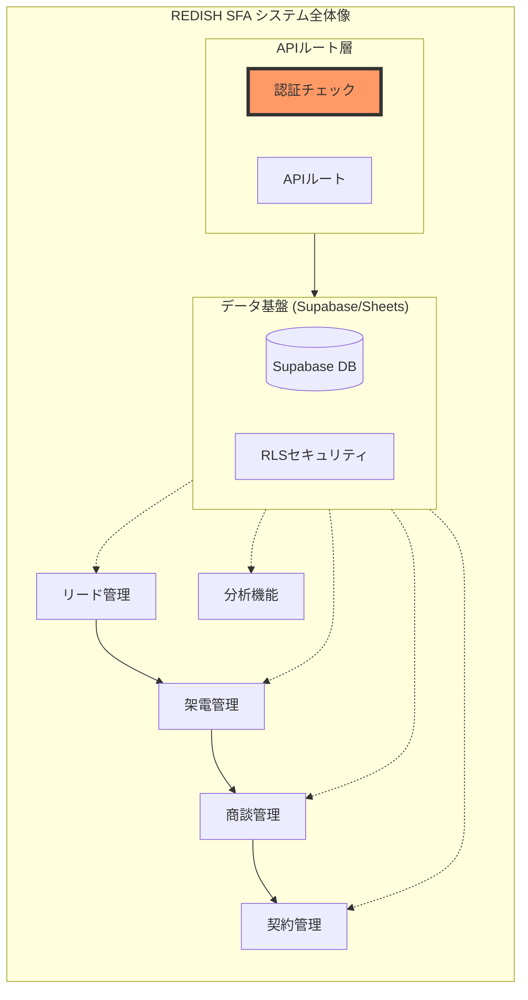

# 要件定義書 (Requirements Document)

## 全体像における位置づけ

*   **今回の位置づけ**: RLSセキュリティに加え、APIルート層での認証チェックを追加し、多層防御を実現する。

---

## はじめに
REDISH SFA システムのAPIルートに認証チェックを追加し、未認証リクエストを拒否する。これにより、Supabase RLS（データベース層）とAPIルート（アプリケーション層）の二重のセキュリティを確立する。

## 要件

### 要件 1: APIルートへの認証ガード追加
**目的:** システム管理者として、未認証ユーザーによるAPI直接アクセスを遮断し、セキュリティを多層化したい。

#### 受け入れ基準
1. **[認証チェック]** 全ての保護対象APIルート（`/api/calls`, `/api/deals`, `/api/call-history`）は、リクエスト処理前にNextAuth.jsセッションを検証しなければならない。
2. **[未認証拒否]** セッションが存在しない（未ログイン）リクエストに対して、HTTPステータス401（Unauthorized）とエラーメッセージを返さなければならない。
3. **[認証済み許可]** 有効なセッションを持つリクエストは、従来通りデータにアクセスできなければならない。
4. **[除外対象]** NextAuth.js関連のAPIルート（`/api/auth/*`）は認証チェックの対象外とする。

### 要件 2: エラーレスポンスの標準化
**目的:** フロントエンド開発者として、認証エラーを適切にハンドリングできるようにしたい。

#### 受け入れ基準
1. **[エラー形式]** 認証エラーレスポンスは `{ error: "認証が必要です", code: "UNAUTHORIZED" }` の形式で返さなければならない。
2. **[HTTPステータス]** 認証エラーはHTTPステータス401で返さなければならない。
3. **[ログ記録]** 認証エラー発生時は、リクエストパスとタイムスタンプをサーバーログに記録しなければならない。

### 要件 3: 既存機能への影響なし
**目的:** 営業担当者として、ログイン後は従来通り全ての機能を利用できるようにしたい。

#### 受け入れ基準
1. **[互換性]** 認証済みユーザーのAPI呼び出しは、レスポンス形式・速度に影響を与えてはならない。
2. **[セッション維持]** 既存のNextAuth.jsセッション管理との互換性を維持しなければならない。
3. **[エラーハンドリング]** フロントエンドは401エラーを受け取った場合、ログイン画面にリダイレクトしなければならない。

---

## 技術メモ
- NextAuth.jsの`getServerSession`を使用してセッション検証
- 共通の認証ガード関数を作成し、各APIルートで再利用
- 既存のAPIルート（`/api/calls`, `/api/deals`, `/api/call-history`）を対象
