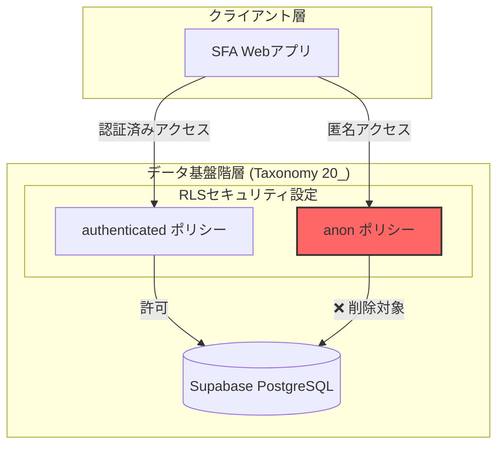
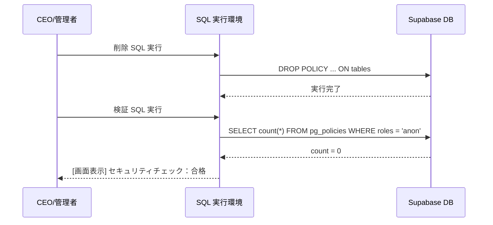

# 技術設計書 (Technical Design Document)

## 概要
REDISH SFA システムのセキュリティを強化するため、未認証ユーザー（`anon` ロール）に付与されている全ての RLS ポリシーを物理的に削除する。これにより、正規の認証（NextAuth.js/Google OAuth）を経由しないデータベースへの直接アクセスを完全に遮断する。

**目的**: この変更により、情報漏洩リスク（未認証者によるデータ閲覧・改ざん）をゼロにする。
**影響ユーザー**: 営業担当者、マネージャー等の正規ユーザーには影響を与えない。
**システム状態の変更**: 既存の `anon` 向け SQL ポリシーを削除し、認証済みユーザー専用のアクセス権限のみを残す。

### ゴール
- Supabase 上の全ての `anon` 向け RLS ポリシーの完全消去。
- 削除後も正規ユーザー（`authenticated`）が支障なく業務を継続できることの保証。
- セキュリティ状態の機械的な検証プロセスの確立。

### 非ゴール
- `authenticated` ロール向けの既存ポリシーの変更・最適化。
- 認証ロジック（NextAuth.js）自体の改修。

## アーキテクチャ

### 今回の変更の位置づけ (Impact Map)

### 技術スタック

| レイヤー | 選択肢 / バージョン | 役割 | 備考 |
| :--- | :--- | :--- | :--- |
| データ / 資産 | Supabase (PostgreSQL) | RLS ポリシーの実行環境 | タクソノミー階層 23.DB |
| 品質保証 | SQL (pg_policies) | セキュリティ状態の検証 | 期待値：anon ポリシー 0件 |

## システムフロー

### セキュリティ修復および検証プロセス

## 要件の追跡 (Requirements Traceability)

| 要件 ID | 概要 | コンポーネント | インターフェース | 備考 |
| :--- | :--- | :--- | :--- | :--- |
| 1.1 | anon ポリシーの削除 | Supabase DB | SQL (DROP POLICY) | `002_remove_anon_policies.sql` |
| 2.1 | 未認証アクセスの遮断 | Supabase DB | RLS | DBエンジンによる強制 |
| 3.1 | 自動検証 | 検証スクリプト | SQL (SELECT pg_policies) | 実行後の品質レポート |

## データモデル

### 物理データモデル（ポリシー変更点）
既存の `supabase/migrations/001_initial_schema.sql` で定義された以下のポリシーを削除対象とする。

**削除対象ポリシー一覧（例）:**
- `call_records`: "Anon users can view/insert/update/delete call_records"
- `call_history`: "Anon users can view/insert/update/delete call_history"
- `deals`: "Anon users can view/insert/update/delete deals"
- `dropdown_settings`: "Anon users can view/insert/update dropdown_settings"

## エラーハンドリング
- **削除失敗**: 指定した名称のポリシーが存在しない場合は `IF EXISTS` を用いてエラーを回避し、冪等性を確保する。
- **検証失敗**: `anon` ポリシーが1件でも残っている場合は、検証クエリが 0 以外の値を返し、システム管理者に警告を通知する。

## テスト戦略
- **単体テスト**: 削除 SQL の構文チェック。
- **結合テスト**: 
    1. 認証なしで API を叩き、401/403 エラーが返ることを確認。
    2. 認証ありで API を叩き、データが正常に取得できることを確認。
- **セキュリティ検証**: `pg_policies` テーブルを照会し、`roles` カラムに `anon` が含まれていないことを機械的に確認。

## ビジネス向け要約 (Executive Summary)
本設計に基づき、データベースの「裏口」を完全に閉じます。これまで開発の利便性のために開けていた「匿名アクセス」という鍵を捨て、全ての扉（テーブル）に「認証（ログイン）」というガードマンを配置します。この作業により、顧客データが外部から直接見られるリスクを完全に排除し、安全な運用基盤を確立します。
