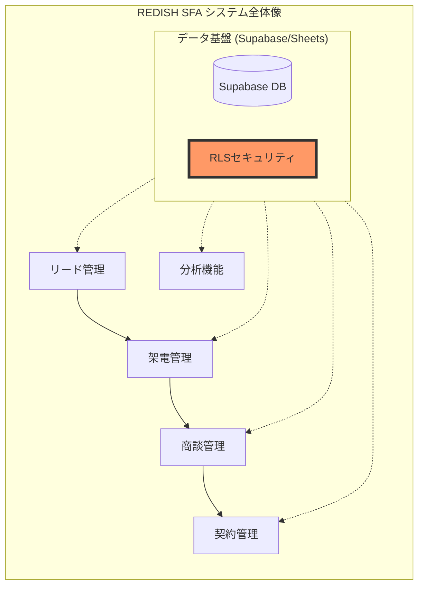

# 要件定義書 (Requirements Document)

## 全体像における位置づけ

*   **今回の位置づけ**: 全ての業務機能（リード、架電、商談等）が動作する上での「安全な土台」を構築する作業です。

---

## はじめに
REDISH SFA システムにおける重大なセキュリティリスクである「anon（未認証ユーザー）へのRLSポリシーによるアクセス許可」を完全に排除する。本スペックの目的は、全てのテーブルにおいて認証済みユーザーのみがデータにアクセスできる状態を保証し、情報漏洩を防止することである。

## 要件

### 要件 1: 既存の anon RLS ポリシーの完全削除
**目的:** 管理者として、未認証ユーザーによるデータへの直接アクセスを遮断し、セキュリティを強固にしたい。

#### 受け入れ基準
1. **[削除]** Supabase データベースは、全てのテーブルに関連付けられた `anon` ロールの RLS ポリシーを削除しなければならない。
2. **[権限排除]** Supabase データベースは、`anon` ロールに対する `select`, `insert`, `update`, `delete` の全ての権限を明示的に取り消さなければならない。
3. **[対象テーブル]** Supabase データベースは、`call_records`, `call_history`, `deals`, `dropdown_settings`, `users` の各テーブルに `anon` アクセスが残っていないことを保証しなければならない。
4. **[画面表示]** 万が一、未認証状態で直接データベースURLを叩いてアクセスを試みた場合、APIはデータを返さず、UIには「アクセス権限がありません」という趣旨のエラーメッセージが表示されること。

### 要件 2: 認証済みユーザー（authenticated）へのアクセス制限の維持
**目的:** システム利用者として、正当なログインプロセスを経たユーザーのみが業務を継続できるようにしたい。

#### 受け入れ基準
1. **[未認証拒否]** ユーザーが認証されていない場合、Supabase データベースは全ての保護されたテーブルへのアクセスを拒否しなければならない。
2. **[認証済み許可]** ユーザーが認証されている場合、Supabase データベースは `authenticated` ロールに定義されたポリシーに基づいてのみアクセスを許可しなければならない。
3. **[既存ポリシー保護]** Supabase データベースは、`anon` ポリシーを削除する際、既存の `authenticated` ユーザー向けの適切なポリシー（例：管理者権限など）を破壊してはならない。
4. **[画面表示]** 正しくログインしたユーザーには、通常通りリード一覧や商談データが表示され、業務に支障が出ないこと。

### 要件 3: セキュリティ状態の自動検証
**目的:** 開発責任者として、修復作業が正しく完了したことを機械的に証明し、将来的な設定ミスを防止したい。

#### 受け入れ基準
1. **[検証実行]** 検証スクリプトが実行された時、システムは `public` スキーマ内に `anon` ロール向けのポリシーが「0件」であることを確認しなければならない。
2. **[異常検知]** もし検証中に `anon` 向けのポリシーが1件でも検出された場合、検証プロセスはセキュリティ違反としてエラーを報告しなければならない。
3. **[画面表示]** 開発環境でのビルド時や検証コマンド実行時に、ターミナルまたは管理画面に「セキュリティチェック：合格（anonポリシー 0件）」という日本語のレポートが表示されること。
