# REDISH SFA データベースER図

> **作成日**: 2026-01-07  
> **バージョン**: 1.0.0  
> **目的**: Supabaseで実装されているデータベース構造の可視化

---

## ER図（Mermaid）

```mermaid
erDiagram
    auth_users ||--o{ users : "1:多"
    users ||--o{ spreadsheet_configs : "作成者"
    call_records ||--o{ call_history : "1:多"
    call_records ||--o{ deals : "1:多"
    
    auth_users {
        uuid id PK
        string email
        timestamp created_at
    }
    
    users {
        uuid id PK "auth.users(id)参照"
        string email UK "UNIQUE"
        string full_name
        string role "admin|manager|staff"
        string department
        timestamp created_at
        timestamp updated_at
    }
    
    call_records {
        uuid id PK
        string lead_id UK "UNIQUE"
        string lead_source "Meetsmore|TEMPOS|OMC|Amazon|Makuake|REDISH"
        date linked_date
        string industry
        string company_name "NOT NULL"
        string contact_name "NOT NULL"
        string contact_name_kana
        string phone "NOT NULL"
        string email
        string address
        string opening_date
        string contact_preferred_datetime
        string alliance_remarks
        string omc_additional_info1
        string omc_self_funds
        string omc_property_status
        string amazon_tax_accountant
        string meetsmore_link
        string meetsmore_entity_type
        string makuake_pjt_page
        string makuake_executor_page
        string status "NOT NULL DEFAULT '未架電'"
        string staff_is
        string status_is
        date status_update_date
        string cannot_contact_reason
        string recycle_priority
        string result_contact_status
        date last_called_date
        integer call_count "DEFAULT 0"
        string call_duration
        text conversation_memo
        string action_outside_call
        date next_action_date
        string next_action_content
        string next_action_supplement
        string next_action_completed
        date appointment_date
        date deal_setup_date
        string deal_time
        string deal_staff_fs
        string deal_result
        string lost_reason_fs
        timestamp created_at
        timestamp updated_at
    }
    
    call_history {
        uuid id PK
        uuid call_record_id FK "call_records(id)参照, ON DELETE CASCADE"
        date call_date "NOT NULL"
        time call_time
        string staff_is "NOT NULL"
        string status "NOT NULL"
        string result
        integer duration
        text memo
        timestamp created_at
    }
    
    deals {
        uuid id PK
        string deal_id UK "UNIQUE"
        string lead_id FK "call_records(lead_id)参照"
        string lead_source
        date linked_date
        string industry
        string company_name "NOT NULL"
        string contact_name "NOT NULL"
        string contact_name_kana
        string phone "NOT NULL"
        string email
        string address
        string opening_date
        string contact_preferred_datetime
        string alliance_remarks
        string omc_additional_info1
        string omc_self_funds
        string omc_property_status
        string amazon_tax_accountant
        string meetsmore_link
        string makuake_link
        text conversation_memo
        string service "RO:開業（融資）|RT:税務|RA:補助金|RB:融資（借り換え）"
        string category "A:飲食|B:非飲食"
        string staff_is
        date appointment_date
        date deal_setup_date
        string deal_time
        string deal_staff_fs
        date deal_execution_date
        string video_link
        string deal_phase
        date phase_update_date
        string rank_estimate
        string rank_change
        date rank_update_date
        date last_contact_date
        date action_scheduled_date
        string next_action_content
        date response_deadline
        string action_completed
        text customer_bant_info
        text competitor_info
        text deal_memo
        string rank "A:80%|B:50%|C:20%|D:10%"
        string detail_rank
        string result "01.成約（契約締結）|02.失注（リサイクル対象外）|03.失注（リサイクル対象）"
        date result_date
        string lost_factor
        string lost_reason
        string lost_after_action
        string feedback_to_is
        string feedback
        numeric amount "DEFAULT 0"
        timestamp created_at
        timestamp updated_at
    }
    
    dropdown_settings {
        uuid id PK
        string category "NOT NULL"
        string key "NOT NULL"
        jsonb options "NOT NULL DEFAULT '[]'"
        timestamp created_at
        timestamp updated_at
        unique category_key "UNIQUE(category, key)"
    }
    
    spreadsheet_configs {
        uuid id PK
        string name "NOT NULL"
        string lead_source_prefix "NOT NULL CHECK(LENGTH=2)"
        string spreadsheet_id "NOT NULL"
        string sheet_name "NOT NULL DEFAULT 'Sheet1'"
        string sheet_gid
        integer header_row "NOT NULL DEFAULT 1"
        jsonb column_mappings "NOT NULL DEFAULT '[]'"
        timestamp last_imported_at
        timestamp created_at
        timestamp updated_at
        uuid created_by FK "users(id)参照, ON DELETE SET NULL"
        unique spreadsheet_sheet "UNIQUE(spreadsheet_id, sheet_name)"
    }
```



---

## ER図（簡易版・ASCII）

```
┌─────────────────────────────────────────────────────────────────┐
│                    REDISH SFA データベース構造                    │
└─────────────────────────────────────────────────────────────────┘

【認証・ユーザー管理】
┌──────────────┐         ┌──────────────┐
│ auth.users   │─────────│    users     │
│ (Supabase)   │ 1:多    │              │
└──────────────┘         └──────────────┘
                                │
                                │ created_by
                                │
                                ▼
                    ┌──────────────────────┐
                    │ spreadsheet_configs   │
                    │ (スプレッドシート設定) │
                    └──────────────────────┘

【営業プロセスフロー】
┌─────────────────────────────────────────────────────────────┐
│                                                             │
│  ┌──────────────┐                                          │
│  │ call_records │  ← リード登録・架電管理                   │
│  │ (架電管理)    │                                          │
│  │              │                                          │
│  │ PK: id       │                                          │
│  │ UK: lead_id  │                                          │
│  └──────┬───────┘                                          │
│         │                                                   │
│         │ call_record_id                                    │
│         │ (1:多)                                            │
│         │                                                   │
│         ▼                                                   │
│  ┌──────────────┐                                          │
│  │ call_history │  ← 架電履歴記録                          │
│  │ (架電履歴)    │                                          │
│  │              │                                          │
│  │ PK: id       │                                          │
│  │ FK: call_record_id                                      │
│  └──────────────┘                                          │
│                                                             │
│  ┌──────────────┐                                          │
│  │ call_records │                                          │
│  └──────┬───────┘                                          │
│         │                                                   │
│         │ lead_id                                           │
│         │ (1:多)                                            │
│         │                                                   │
│         ▼                                                   │
│  ┌──────────────┐                                          │
│  │    deals     │  ← 商談管理・成約管理                    │
│  │  (商談管理)   │                                          │
│  │              │                                          │
│  │ PK: id       │                                          │
│  │ UK: deal_id  │                                          │
│  │ FK: lead_id  │                                          │
│  │              │                                          │
│  │ 主要カラム:   │                                          │
│  │ - service    │                                          │
│  │ - category   │                                          │
│  │ - rank       │                                          │
│  │ - result     │                                          │
│  │ - amount     │                                          │
│  └──────────────┘                                          │
│                                                             │
└─────────────────────────────────────────────────────────────┘

【設定管理】
┌──────────────────────┐
│ dropdown_settings    │  ← ドロップダウン設定
│ (設定管理)            │
│                      │
│ PK: id               │
│ UK: (category, key)  │
└──────────────────────┘

【データフロー】
┌─────────────────────────────────────────────────────────────┐
│                                                             │
│  1. リード登録                                              │
│     └─→ call_records (status: '未架電')                    │
│                                                             │
│  2. 架電実施                                                │
│     ├─→ call_records (status更新)                          │
│     └─→ call_history (履歴記録)                            │
│                                                             │
│  3. アポイント獲得                                          │
│     └─→ call_records (appointment_date設定)                │
│                                                             │
│  4. 商談設定                                                │
│     └─→ deals (deal_id生成, lead_idで紐付け)              │
│                                                             │
│  5. 商談実施・確度管理                                      │
│     └─→ deals (rank更新: A:80%, B:50%, C:20%, D:10%)     │
│                                                             │
│  6. 成約/失注                                               │
│     └─→ deals (result設定, amount設定)                     │
│                                                             │
└─────────────────────────────────────────────────────────────┘

【主要リレーションシップ】
┌─────────────────────────────────────────────────────────────┐
│                                                             │
│  auth.users ──(1:多)──> users                              │
│    │                                                        │
│    └─(CASCADE削除)                                         │
│                                                             │
│  call_records ──(1:多)──> call_history                     │
│    │                                                        │
│    └─(CASCADE削除)                                         │
│                                                             │
│  call_records ──(1:多)──> deals                            │
│    │                                                        │
│    └─(lead_idで参照)                                       │
│                                                             │
│  users ──(1:多)──> spreadsheet_configs                     │
│    │                                                        │
│    └─(SET NULL削除)                                        │
│                                                             │
└─────────────────────────────────────────────────────────────┘
```

---

## テーブル説明

### 1. `users` - ユーザー管理
- **目的**: Supabase Authと連携したユーザー情報管理
- **主キー**: `id` (UUID, `auth.users(id)`参照)
- **特徴**: 
  - ロール管理（admin/manager/staff）
  - 部署情報の保持

### 2. `call_records` - 架電管理
- **目的**: リード情報と架電ステータス管理
- **主キー**: `id` (UUID)
- **ユニークキー**: `lead_id` (TEXT)
- **特徴**:
  - リードソース別の情報を保持（Meetsmore, TEMPOS, OMC, Amazon, Makuake, REDISH）
  - 架電ステータス管理（未架電、架電中、アポイント獲得済等）
  - 商談設定情報も含む（deal_setup_date, deal_staff_fs等）

### 3. `call_history` - 架電履歴
- **目的**: 各架電記録の詳細履歴
- **主キー**: `id` (UUID)
- **外部キー**: `call_record_id` → `call_records(id)` (ON DELETE CASCADE)
- **特徴**:
  - 1つの架電記録に対して複数の履歴を保持（1:多）
  - 架電日時、結果、メモを記録

### 4. `deals` - 商談管理
- **目的**: 商談情報と成約管理
- **主キー**: `id` (UUID)
- **ユニークキー**: `deal_id` (TEXT, SA0001形式)
- **外部キー**: `lead_id` → `call_records(lead_id)` (TEXT参照)
- **特徴**:
  - 商談確度管理（rank: A:80%, B:50%, C:20%, D:10%）
  - 成約情報も含む（result: 成約/失注）
  - 成約金額（amount）を保持（003_add_amount_to_deals.sqlで追加）
  - 成約管理画面では `result = '01.成約（契約締結）'` でフィルタリング

### 5. `dropdown_settings` - 設定管理
- **目的**: ドロップダウン選択肢の動的管理
- **主キー**: `id` (UUID)
- **ユニークキー**: `(category, key)`
- **特徴**: JSONB形式で選択肢を保持

### 6. `spreadsheet_configs` - スプレッドシート連携設定
- **目的**: Googleスプレッドシート連携設定の管理
- **主キー**: `id` (UUID)
- **ユニークキー**: `(spreadsheet_id, sheet_name)`
- **外部キー**: `created_by` → `users(id)` (ON DELETE SET NULL)
- **特徴**:
  - リードソース別のスプレッドシート設定を保持
  - カラムマッピング情報をJSONBで保存

---

## リレーションシップ詳細

| 関係 | 親テーブル | 子テーブル | カーディナリティ | 外部キー | 削除動作 |
|------|-----------|-----------|----------------|---------|---------|
| Auth連携 | `auth.users` | `users` | 1:多 | `users.id` → `auth.users(id)` | CASCADE |
| 架電履歴 | `call_records` | `call_history` | 1:多 | `call_history.call_record_id` → `call_records(id)` | CASCADE |
| 商談管理 | `call_records` | `deals` | 1:多 | `deals.lead_id` → `call_records(lead_id)` | - |
| 設定作成者 | `users` | `spreadsheet_configs` | 1:多 | `spreadsheet_configs.created_by` → `users(id)` | SET NULL |

---

## データフロー

```
【営業プロセスフロー】

1. リード登録
   └─→ call_records (status: '未架電')

2. 架電実施
   ├─→ call_records (status更新: '架電中', 'アポイント獲得済'等)
   └─→ call_history (架電履歴記録)

3. アポイント獲得
   └─→ call_records (appointment_date設定)

4. 商談設定
   ├─→ deals (deal_id生成, lead_idでcall_recordsと紐付け)
   └─→ call_records (deal_setup_date設定)

5. 商談実施・確度管理
   └─→ deals (rank更新: A:80%, B:50%, C:20%, D:10%)

6. 成約/失注
   └─→ deals (result設定: '01.成約（契約締結）'等, amount設定)
```

---

## インデックス一覧

| テーブル | インデックス名 | カラム | 目的 |
|---------|--------------|--------|------|
| `call_records` | `idx_call_records_lead_id` | `lead_id` | リードID検索 |
| `call_records` | `idx_call_records_status` | `status` | ステータス検索 |
| `call_records` | `idx_call_records_staff_is` | `staff_is` | 担当者検索 |
| `call_history` | `idx_call_history_call_record_id` | `call_record_id` | 架電記録検索 |
| `deals` | `idx_deals_deal_id` | `deal_id` | 商談ID検索 |
| `deals` | `idx_deals_lead_id` | `lead_id` | リードID検索 |
| `deals` | `idx_deals_result` | `result` | 成約/失注検索 |
| `deals` | `idx_deals_staff_is` | `staff_is` | 担当者検索 |
| `deals` | `idx_deals_result_date` | `result_date` | 成約日検索（003で追加） |
| `spreadsheet_configs` | `idx_spreadsheet_configs_spreadsheet_id` | `spreadsheet_id` | スプレッドシートID検索 |
| `spreadsheet_configs` | `idx_spreadsheet_configs_name` | `name` | 連携先名検索 |
| `spreadsheet_configs` | `idx_spreadsheet_configs_created_at` | `created_at DESC` | 作成日時ソート |

---

## セキュリティ（RLS）

### 現在の状態
- ✅ **anonポリシー削除済み**（002_remove_anon_policies.sql適用済み）
- ✅ **authenticatedポリシーのみ有効**
- ✅ **APIルート認証ガード実装済み**（`frontend/src/lib/auth/guard.ts`）

### RLSポリシー概要
- **認証済みユーザー（authenticated）**: 全テーブルに対して全操作（SELECT/INSERT/UPDATE/DELETE）可能
- **匿名ユーザー（anon）**: アクセス不可（セキュリティ強化済み）
- **サービスロール（service_role）**: `spreadsheet_configs`のみ全操作可能（定期実行用）

---

## 更新履歴

| 日付 | 変更内容 | マイグレーション |
|------|---------|----------------|
| 2025-12-19 | 初版スキーマ作成 | `001_initial_schema.sql` |
| 2026-01-05 | anon RLSポリシー削除 | `002_remove_anon_policies.sql` |
| 2026-01-05 | `deals.amount`カラム追加 | `003_add_amount_to_deals.sql` |
| 2026-01-05 | `spreadsheet_configs`テーブル追加 | `004_add_spreadsheet_configs.sql` |
| 2026-01-07 | ER図作成 | このドキュメント |

---

## 参照

- **マイグレーションファイル**: `supabase/migrations/`
- **型定義**: `frontend/src/types/sfa.ts`
- **データ整合性検証**: `docs/03_実装完了報告/2026-01-07_SFAデータ整合性検証レポート.md`
- **PROJECT_CONTROL**: `PROJECT_CONTROL.md`
